# Pipeline de Données Agricoles

Ce projet fournit un pipeline robuste de data engineering pour le traitement de données agricoles à l’aide d’**Azure Data Factory**, **Azure Databricks** et **Azure Synapse Analytics**.  
Le pipeline automatise l’ingestion, le traitement et le stockage des données dans les couches **bronze**, **silver** et **gold**, préparant les données pour l’analyse et la visualisation.

---

## Cas d’Usage

Les données agricoles (météo, sol, production) sont essentielles pour améliorer les rendements, anticiper les conditions climatiques et gérer les ressources de manière durable.  
Les parties prenantes telles que les agriculteurs, les ingénieurs agronomes, les instituts de recherche ou les décideurs politiques s’appuient sur des informations précises et à jour pour :

- Planifier les cultures et les ressources.
- Évaluer les risques liés au climat.
- Prendre des décisions éclairées basées sur les données.

En automatisant la collecte et la transformation des données agricoles, ce pipeline permet aux utilisateurs de **prédire, analyser et optimiser** les activités agricoles avec précision et rapidité.

---

## Architecture & Technologies

Ce projet repose sur une architecture moderne de type **Medallion** (Bronze / Silver / Gold) pour le traitement et l’analyse des données météorologiques.

### Pipeline global

Le pipeline suit cette structure logique :

1. **Azure Data Factory (ADF)** : Orchestration de l’ingestion depuis un fichier CSV de villes et exécution de notebooks.
2. **Azure Data Lake Storage Gen2** : Stockage des données brutes, semi-traitées et enrichies.
3. **Azure Databricks** : Traitement Spark distribué en 3 couches :
   - **Bronze** : Données brutes collectées via une API météo.
   - **Silver** : Données nettoyées, structurées (séparation date/heure, format parquet).
   - **Gold** : Données enrichies (ville, pays, classification de température).
4. **Azure Synapse Analytics** : Lecture et requêtage des données Parquet depuis le lac.
5. **Power BI** : Création de visualisations interactives à partir des données analysées.

### Architecture visuelle

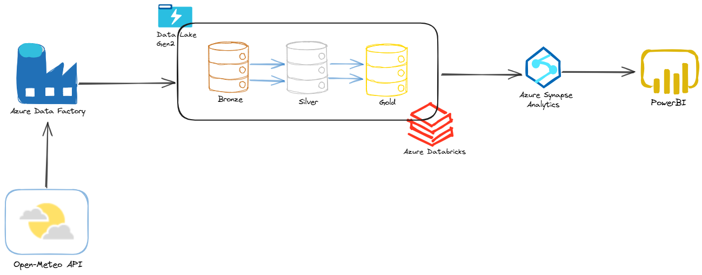

### Stack technique utilisée

| Composant             | Rôle principal                          |
|-----------------------|------------------------------------------|
| Azure Data Factory    | Orchestration des notebooks              |
| Azure Storage Gen2    | Stockage structuré en Bronze/Silver/Gold |
| Azure Databricks      | Traitement Spark, API, enrichissement    |
| Azure Synapse         | Requêtes SQL sur Parquet                 |
| Power BI              | Visualisation des données finales        |
| API OpenMeteo         | Source de données météo                  |
| Python + PySpark      | Traitement de données                    |
| Librairie `reverse_geocoder` | Récupération ville/pays à partir des coordonnées |

---

## Azure Setup

Cette section décrit la mise en place des services Azure nécessaires au fonctionnement du pipeline. L’objectif est d’assurer une communication fluide entre les différentes briques du projet.

### Création des ressources Azure

Plusieurs services Azure ont été provisionnés pour mettre en œuvre l’architecture Medallion :

- **Azure Data Lake Storage Gen2**  
  Utilisé pour stocker les fichiers dans les différentes couches : `bronze`, `silver` et `gold`.  
  → Trois conteneurs ont été créés : `bronze`, `silver` et `gold`.

- **Azure Databricks**  
  Un workspace Databricks a été créé pour exécuter les traitements distribués avec PySpark.  
  Un cluster a été lancé, avec la librairie `reverse_geocoder` installée pour enrichir les données par géolocalisation.

- **Azure Synapse Analytics**  
  Créé pour interroger les fichiers Parquet présents dans la couche Gold, via le langage SQL.

- **Azure Data Factory (ADF)**  
  Utilisé pour orchestrer l’ensemble du pipeline : déclenchement automatique chaque jour à minuit, itération sur les villes, exécution des notebooks.

---
## Source des données météo – API Open-Meteo

Le projet utilise l’API gratuite [Open-Meteo](https://open-meteo.com/), qui fournit les prévisions horaires par coordonnées géographiques (latitude / longitude).

### Exemple de requête envoyée
<pre>
https://api.open-meteo.com/v1/forecast?
latitude=48.85&
longitude=2.35&
hourly=temperature_2m,soil_temperature_0cm,precipitation&
timezone=Europe/Paris
</pre>
### Exemple de réponse (résumé) :
<pre>
{
  "hourly": {
    "time": [...],
    "temperature_2m": [...],
    "soil_temperature_0cm": [...],
    "precipitation": [...]
  }
}
</pre>
  - `temperature_2m`: température de l’air à 2m
  - `soil_temperature_0cm`: température du sol en surface
  - `precipitation`: précipitations horaires
---

## Databricks – Traitement des données

Le traitement des données se fait en trois étapes à l’aide de notebooks PySpark dans Databricks. Chaque notebook correspond à une couche du pipeline : Bronze, Silver ou Gold.

### 1. Configuration du cluster et librairie

#### Création de cluster Databrick.  
Nous avons installé la librairie suivante dans le cluster :
#### Configuration du cluster
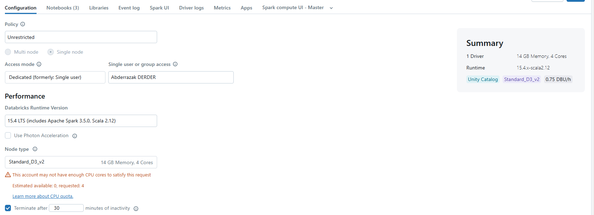
#### Compute Databricks
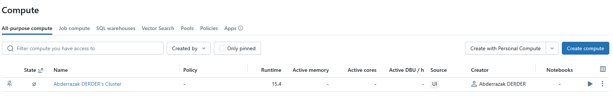

- `reverse_geocoder` → permet d'enrichir chaque ligne avec le nom de la ville et le code pays à partir de la latitude et longitude.
#### Ajout de la librairie reverse_geocoder
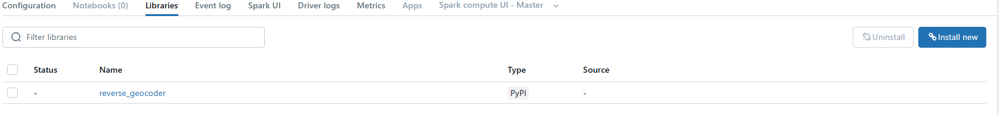

---
### 2. Connexion entre services

Afin que tous les services puissent interagir avec le Data Lake, plusieurs étapes de configuration ont été nécessaires :

- **Création des credentials + external location dans Databricks**  
  Ces éléments permettent à Databricks d’accéder aux fichiers dans le Data Lake via les chemins `abfss://`.
 #### Credential
  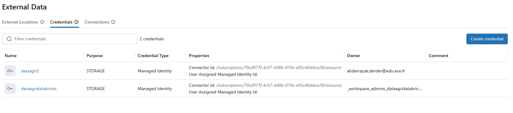
 #### External Location
  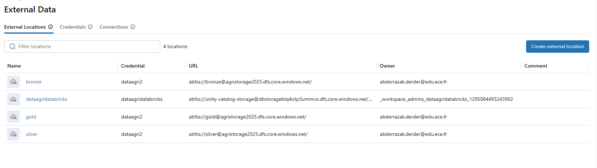

- **Gestion des rôles et permissions (IAM)**  
  Il a fallu attribuer le rôle suivant au service principal de Databricks :
  → `Storage Blob Data Contributor`
 #### IAM Role
  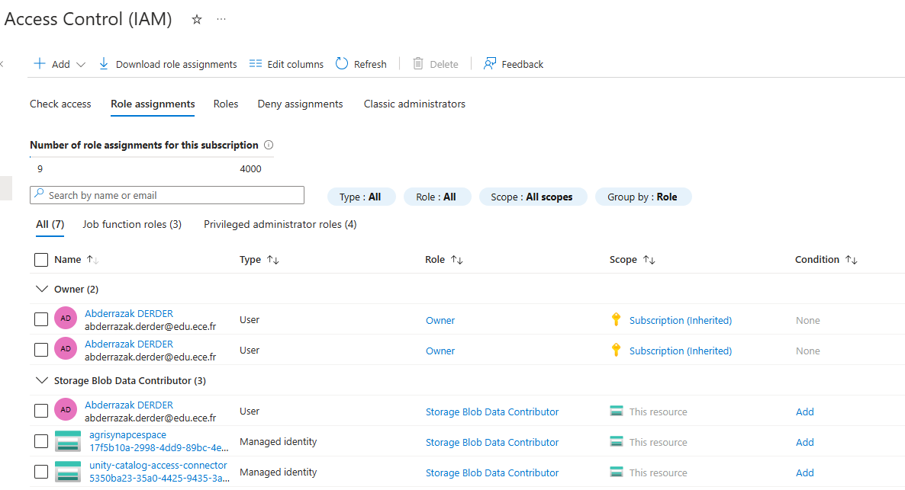

### 3. Bronze Notebook – Récupération des données météo

#### Étapes du traitement :

- Lecture des paramètres transmis par Azure Data Factory : `latitude`, `longitude`, `ville`, `pays`, `today`
- Requête HTTP vers l’API [Open-Meteo](https://open-meteo.com/), avec récupération des paramètres :
  - `temperature_2m`
  - `soil_temperature_0cm`
  - `precipitation`
- Vérification du contenu retourné par l’API
- Ajout des champs `latitude`, `longitude`, `ville`, `pays`, `date` dans le JSON
- Sauvegarde d’un fichier JSON par ville et par jour dans le conteneur **bronze**, chemin :
<pre>abfss://bronze@agristorage2025.dfs.core.windows.net/meteo/<pays><ville><today>.json</pre>

---

### 4. Silver Notebook – Transformation des données

Le notebook Silver lit les fichiers JSON du Bronze, nettoie et structure les données.

#### Traitements effectués :

- Extraction des listes `time`, `temperature_2m`, `soil_temperature_0cm`, `precipitation`
- Utilisation de `posexplode` pour aligner chaque valeur sur son horodatage
- Conversion du champ `time` en type `timestamp`
- Séparation de `datetime` en deux colonnes : `date` (YYYY-MM-DD) et `heure` (HH:mm)
- Ajout des colonnes `latitude`, `longitude`, `ville`, `pays`
- Enregistrement du résultat au format **Parquet** dans le conteneur Silver :

<pre> abfss://silver@agristorage2025.dfs.core.windows.net/meteo/<pays><ville><today>.parquet</pre>

---

### 5. Gold Notebook – Enrichissement et préparation finale

Le Gold Notebook lit tous les fichiers Silver du jour, enrichit les données et les agrège.

#### Étapes clés :

- Lecture de tous les fichiers du jour :

<pre> df = spark.read.parquet(f"{silver_adls}/meteo/*_{today}.parquet") </pre>

- Ajout des colonnes country_code et city à l’aide de la fonction reverse_geocoder

- Un UDF PySpark personnalisé a été utilisé pour intégrer reverse_geocoder dans le pipeline Spark.

- Ajout d'une colonne stemp_class qui catégorise les températures :
   - soil_temperature_0cm <0°C → gel
   - soil_temperature_0cm 0°C et 10°C → froid
   - soil_temperature_0cm entre 10°C et 20°C → modéré
   - soil_temperature_0cm entre 20°C et 30°C → chaud
   - soil_temperature_0cm > 30°C → très chaud
> La classification `stemp_class` est basée sur la température du sol, car elle est plus représentative des conditions réelles pour l’agriculture que la température de l’air seule.
- Écriture dans le conteneur Gold :
  <pre>abfss://gold@agristorage2025.dfs.core.windows.net/weather_gold/<today>/</pre>
#### Schéma final :
- `date`
- `heure`
- `temperature_2m`
- `soil_temperature_0cm`
- `precipitation`
- `latitude`,  `longitude`
- `country_code`,  `city`
- `stemp_class`
---
## Azure Data Factory – Orchestration du pipeline

L'orchestration complète du pipeline a été mise en place avec **Azure Data Factory ()**, en utilisant des blocs visuels comme `Lookup`, `ForEach`, et `Execute Notebook`. L'objectif est d'automatiser le traitement des données météo pour plusieurs villes chaque jour.

---

### 1. Ingestion multi-villes

La première étape consiste à importer un **fichier CSV** contenant la liste des villes à traiter. Ce fichier contient les colonnes suivantes :

- `ville`
- `pays`
- `latitude`
- `longitude`
#### Fichier CSV villes
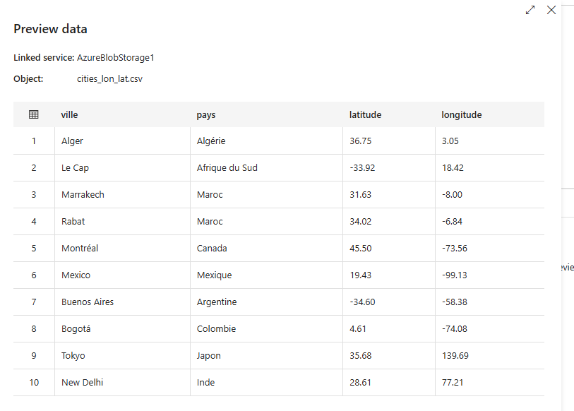

Ce fichier est stocké dans un **dataset ** de type CSV.

#### Étapes dans le pipeline :
- Un bloc **Lookup** est utilisé pour lire le fichier.
- Ce lookup renvoie une liste d’objets JSON (une par ville).
- Un bloc **ForEach** permet d’itérer sur chaque ligne.

Dans la boucle `ForEach`, plusieurs paramètres sont passés à Databricks pour chaque exécution :

- `ville`
- `pays`
- `latitude`
- `longitude`
- `today` (généré dynamiquement dans  avec `@utcNow()`)

---

### 2. Orchestration complète

À l’intérieur du bloc `ForEach`, deux notebooks sont appelés de manière séquentielle :

#### a. Bronze Notebook
- Récupère les données depuis l’API Open-Meteo
- Stocke les fichiers JSON dans Bronze

#### b. Silver Notebook
- Lit les fichiers Bronze
- Transforme et stocke les données en Parquet dans Silver

> Les deux notebooks utilisent `dbutils.widgets.get(...)` pour récupérer les paramètres passés depuis .

#### c. Gestion des retours de notebook
Chaque notebook retourne un dictionnaire JSON sérialisé avec `dbutils.notebook.exit(json.dumps(...))`.  
Ce retour permet de transmettre des informations à l’étape suivante, comme `today`, `silver_adls`, `gold_adls`, etc.

---

### 3. Exécution finale – Gold Notebook

Une fois la boucle `ForEach` terminée, un troisième notebook est exécuté **hors de la boucle** :

- Il récupère tous les fichiers Silver du jour (`*_{today}.parquet`)
- Applique l'enrichissement (ville/pays + classification)
- Stocke les données finales dans la couche Gold

Les paramètres (`today`, `silver_adls`, `gold_adls`) sont transmis à ce notebook soit via le premier `Bronze Notebook`, soit fixés dans .
#### Pipline 
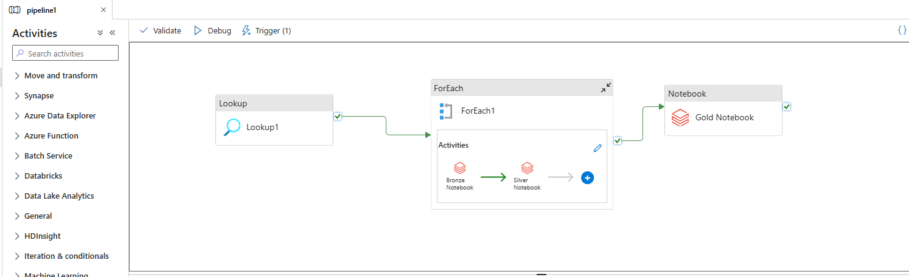

---

### 4. Déclencheur automatique (Trigger)

Pour automatiser l'exécution, un **Schedule Trigger** a été configuré dans ADF :

- **Fréquence** : quotidienne
- **Heure** : 00:00 (minuit UTC)
- **Action** : déclenchement complet du pipeline

Cela permet d’avoir une **mise à jour automatique des données météo** sans intervention manuelle.
#### Déclencheur ADF
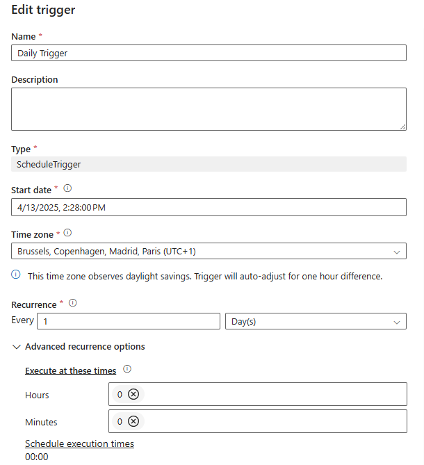

---

## Synapse & Power BI

Une fois les données enrichies et stockées dans la couche Gold (au format Parquet), elles peuvent être analysées directement via **Azure Synapse Analytics** en mode serverless, puis visualisées dans **Power BI**.

### 1. Lecture des fichiers Parquet avec OPENROWSET

Dans Synapse, il n’est pas nécessaire d'importer les données. On peut interroger directement les fichiers Parquet stockés dans le Data Lake grâce à la fonction `OPENROWSET`.

#### Exemple de requête :

<pre>
SELECT *
FROM OPENROWSET(
    BULK 'https://agristorage2025.dfs.core.windows.net/gold/weather_gold/**',
    FORMAT = 'PARQUET'
) AS meteo  </pre>
#### Requête OPENROWSET
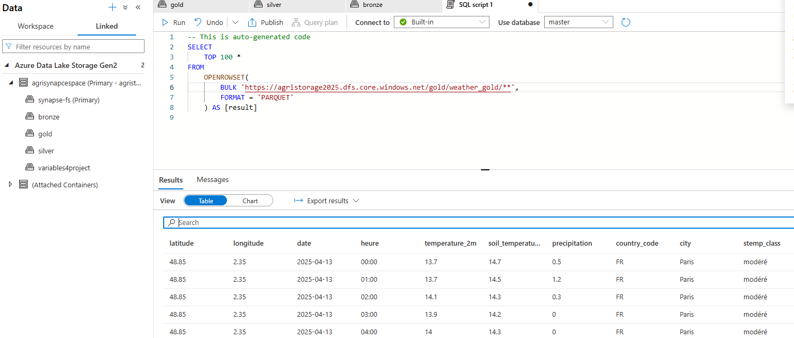

### 2. Connexion à Synapse depuis Power BI
Dans Power BI Desktop :

- Accueil > Obtenir les données

- On choisis Azure Synapse Analytics (SQL Serverless)

- Server : Serverless SQL endpoint
- Base de données : master et on écrirs une requête manuelle

#### Visuels utilisés

| Type de visuel            | Données utilisées                                     |
|---------------------------|--------------------------------------------------------|
| **Courbe**                | Température (`temperature_2m`) par heure (`heure`)    |
| **Carte géographique**    | Coordonnées (`latitude`, `longitude`)                 |
| **Histogramme / Camembert** | Nombre d'observations par `stemp_class` (modéré, chaud…) |
| **Segments (filtres)**    | Champs : `ville`, `pays`, `date`, `stemp_class`       |

#### Dashboard météo Power BI
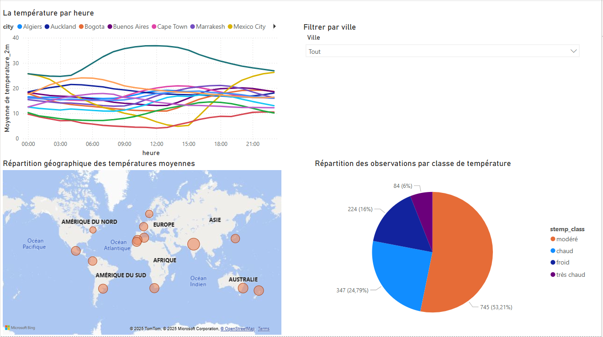

